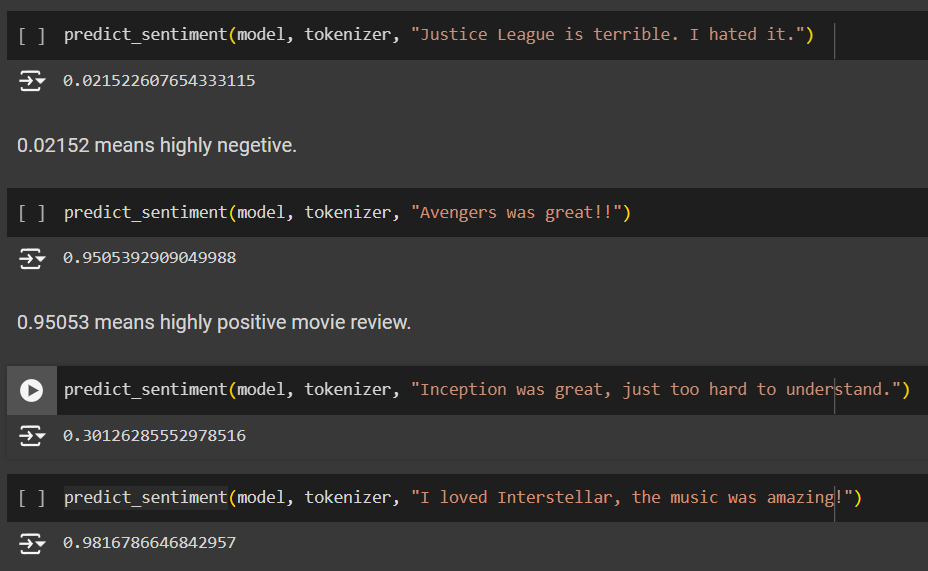

# Analyzing Movie Reviews Using BERT Transformers

This repository contains an implementation of a BERT-based model to analyze movie reviews. The project demonstrates the ability to classify movie reviews as positive or negative using a BERT transformer.

## Setup and Usage

### Clone the Repository
```bash
git clone https://github.com/yourusername/bert_movie_reviews.git
cd bert_movie_reviews
```

### Launch Jupyter Notebook

```bash
jupyter notebook Analyzing_movie_reviews_using_bert_transformers.ipynb
```

### Run All Cells
Execute all cells in the notebook to preprocess data, define models, and start the training process.

## Results and Observations

### Example results:
<p align="center">
  
</p>
